# Battery Pack Design & Construction

The Accumulator Container/Battery Pack consists of 288 batteries with maximum voltage and energy of 600V and 7.45kWh respectively. The lithium-ion cells are separated on 12 segments of batteries (12s2p). It also consists of 2 high-voltage relay contactors and a high current fast-blow fuse.

The full assembly of the battery container.

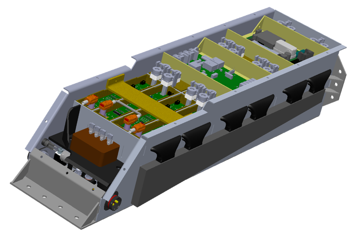

Bellow, it is shown the design of one segment.

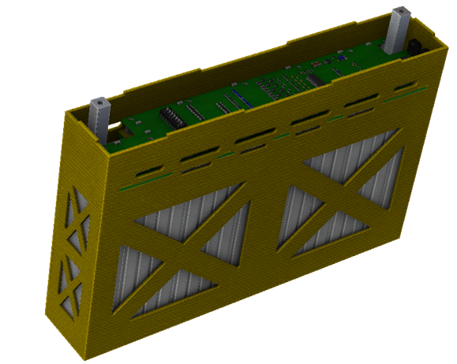

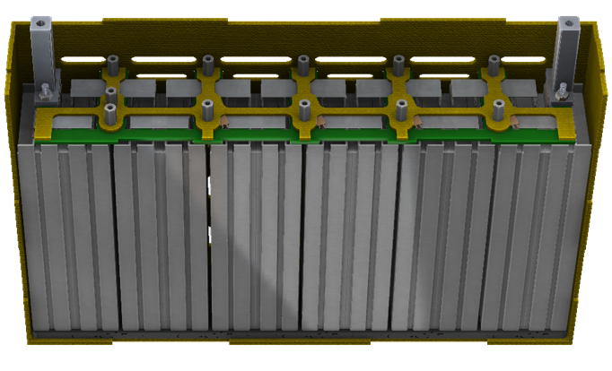

A small PCB and a kevlar piece is placed for the BMS voltage measurements.

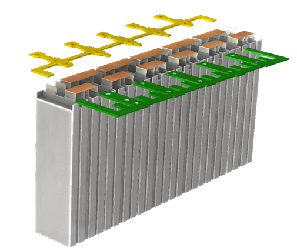
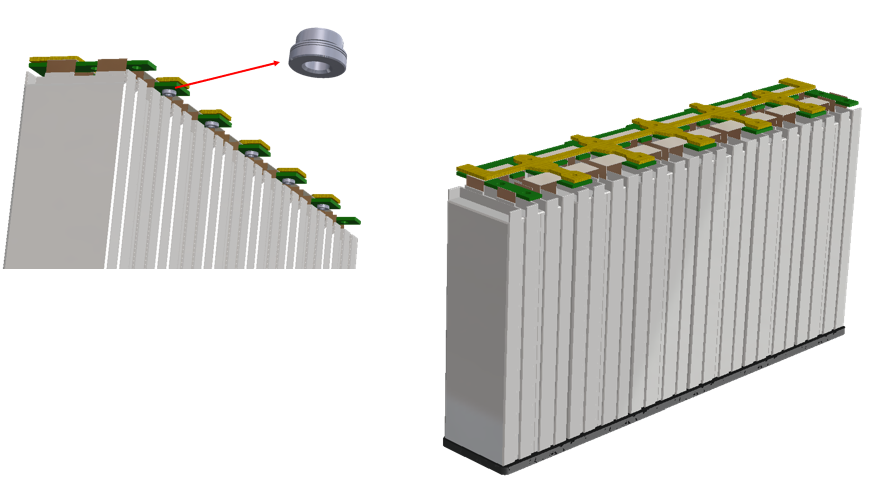

Bellow, the BMS PCB is presented.

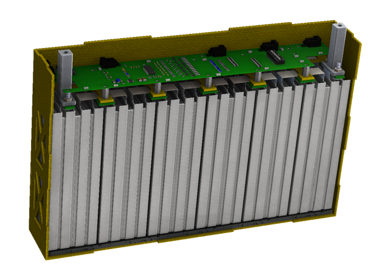
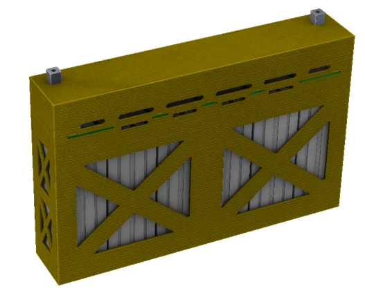

The assembly of the segments.

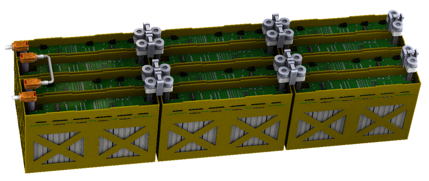

The aluminum container of the battery pack.

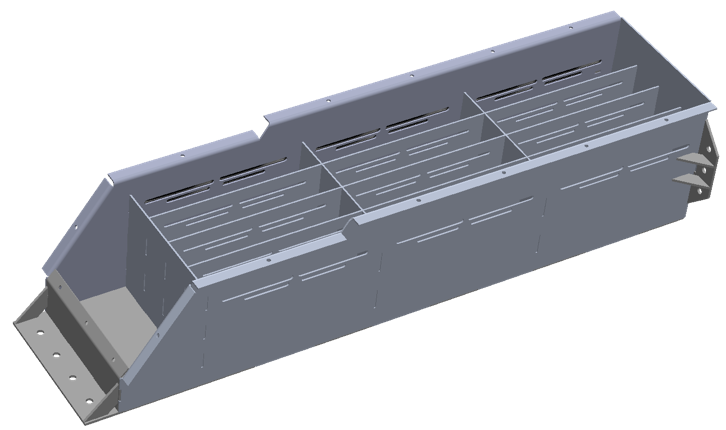
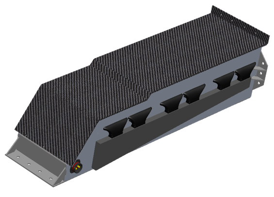

The two relay contactors and the fuse are placed in the front part of the container.

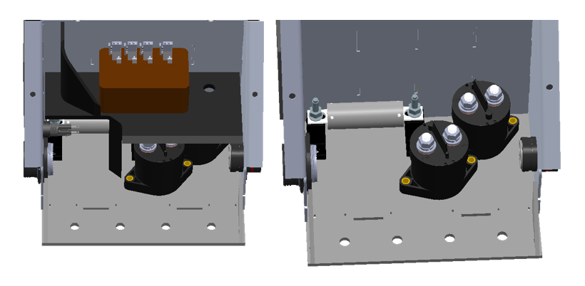 
